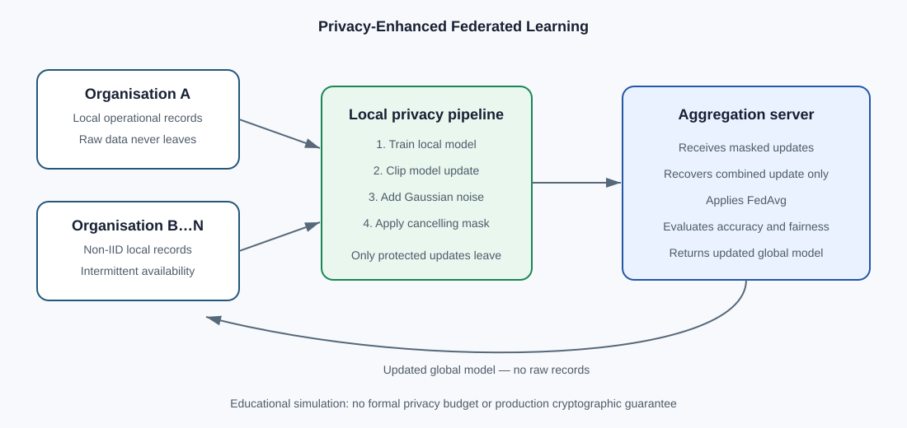

# Privacy-Enhanced Federated Learning for Collaborative Incident Prediction

[](https://www.python.org/)
[](LICENSE)

A reproducible, explainable Python prototype showing how simulated organisations can jointly train an incident-prediction model while keeping raw operational records local. It investigates **non-IID data**, **intermittent availability**, clipped/noised model updates, communication cost and unequal outcomes across clients.

> **Scope:** educational research prototype. It implements privacy-enhancing mechanisms but does not claim a formal privacy guarantee, production cryptographic security or theoretical convergence.

## Research question

How do intermittent participation and privacy-enhancing model updates affect aggregate accuracy, worst-client performance, attack exposure and communication cost in federated learning?

## Architecture



Each round samples available clients, distributes the current global model, performs local logistic-regression updates and aggregates parameters using training-set size. Evaluation covers the combined test set and each client separately.

## Implemented features

- Synthetic binary classification with client-level distribution shifts
- Non-IID partitions without personal data
- Centralized and local-only baselines
- FedAvg with stochastic availability and minimum participation
- Per-client update clipping and configurable Gaussian noise
- Cancelling-mask secure-aggregation simulation
- Illustrative confidence-based membership-inference AUC
- Accuracy, precision, recall, F1 and worst-client accuracy
- Participation counts, participation gap and estimated communication bytes
- Round-by-round JSON history and deterministic random seeds
- Unit tests for metrics, reproducibility and data shapes
- Plain-English HTML reporting for non-technical reviewers
- Multi-seed comparison across five availability levels

## Verified protected run

Configuration: 8 clients, 180 samples per client, 10 features, 40 rounds, availability 0.65, seed 42, clipping norm 1.0, noise multiplier 0.15 and simulated secure aggregation.

| Method | Global accuracy | Precision | Recall | F1 | Mean client accuracy | Worst-client accuracy |
|---|---:|---:|---:|---:|---:|---:|
| Centralized | 0.850 | 0.837 | **0.936** | 0.884 | 0.850 | 0.800 |
| Local only | N/A | - | - | - | 0.836 | 0.733 |
| Protected FedAvg | **0.869** | **0.884** | 0.904 | **0.894** | **0.869** | **0.800** |

Protected FedAvg transferred an estimated 37,136 parameter bytes. Participation ranged from 22 to 30 rounds. The illustrative membership-attack AUC was 0.522 (0.5 is random guessing). These values describe one deterministic synthetic run; they do **not** establish general superiority or a formal privacy guarantee. See [`results/protected_seed_42.json`](results/protected_seed_42.json).

## Multi-seed availability study

Five seeds were tested per availability level. The attack diagnostic was already close to random guessing without noise, so this experiment does **not** demonstrate a measurable attack reduction; it demonstrates how to measure and report the trade-off honestly.

| Availability | Standard accuracy | Protected accuracy | Protected worst client | Attack AUC standard → protected |
|---:|---:|---:|---:|---:|
| 30% | 0.882 | 0.856 | 0.747 | 0.508 → 0.509 |
| 50% | 0.878 | 0.873 | 0.773 | 0.509 → 0.509 |
| 65% | 0.882 | 0.880 | 0.791 | 0.509 → 0.509 |
| 80% | 0.881 | 0.880 | 0.800 | 0.508 → 0.509 |
| 100% | 0.881 | 0.882 | 0.787 | 0.509 → 0.509 |

## Repository structure

```text
├── .github/workflows/tests.yml
├── docs/architecture.svg
├── fl_testbed/core.py
├── results/baseline_seed_42.json
├── tests/test_core.py
├── run_experiment.py
├── pyproject.toml
├── requirements.txt
├── CONTRIBUTING.md
├── CITATION.cff
└── LICENSE
```

## Quick start

```bash
git clone https://github.com/31-prachi/trustworthy-federated-learning-testbed.git
cd trustworthy-federated-learning-testbed
python -m venv .venv
source .venv/bin/activate        # Windows: .venv\Scripts\activate
python -m pip install -r requirements.txt
python run_experiment.py --rounds 40 --clients 8 --availability 0.65 --seed 42 --noise-multiplier 0.15
```

Run tests:

```bash
python -m pytest -v
```

Open the non-technical report after a run:

```powershell
start results/report.html
```

Run the five-seed availability study:

```bash
python run_study.py
```

## Experiment options

| Argument | Meaning | Default |
|---|---|---:|
| `--clients` | Number of simulated clients | 8 |
| `--samples-per-client` | Observations per client | 180 |
| `--features` | Input features | 10 |
| `--rounds` | Federated rounds | 40 |
| `--availability` | Availability probability in (0, 1] | 0.65 |
| `--seed` | Reproducibility seed | 42 |
| `--clip-norm` | Maximum L2 norm of each client update | 1.0 |
| `--noise-multiplier` | Gaussian noise strength; 0 disables noise | 0.15 |
| `--secure-aggregation` | Enable cancelling-mask simulation | true |

## Methodology

1. Generate one prediction problem with client-specific feature shifts and label bias.
2. Reserve 25% of each client's observations for evaluation.
3. Train centralized and local-only comparison models.
4. Sample available clients independently in every federated round.
5. Train locally from the current global parameters.
6. Aggregate local parameters by training-set size.
7. record aggregate metrics, client metrics, participation and communication cost.

## Scientific and ethical boundaries

- All data are synthetic.
- Availability is independent and random rather than learned from real traces.
- Communication cost counts parameter transfer but not protocol overhead.
- Logistic regression does not represent the cost of a large neural model.
- Gaussian noise is implemented, but formal epsilon/delta accounting is not.
- Secure aggregation is simulated inside one process, not deployed cryptography.
- Membership-inference AUC is illustrative, not a comprehensive privacy audit.
- Synthetic operational records do not establish real-world performance.

## Roadmap

- [ ] Compare random, availability-aware and fairness-aware selection
- [ ] Run multiple seeds and report confidence intervals
- [ ] Model correlated and predictable availability
- [ ] Add differentially private updates with privacy accounting
- [ ] Evaluate membership-inference or gradient-leakage risks
- [ ] Add energy and carbon-aware scheduling
- [ ] Extend to a public dataset and neural model

## Interview-ready summary

> I built a federated-learning testbed to examine a practical assumption hidden by many FedAvg demonstrations: clients are not always available. It compares centralized, local-only and federated baselines on non-IID synthetic data, while recording aggregate performance, worst-client performance, participation imbalance and communication cost. The initial run shows why accuracy alone is insufficient: aggregate accuracy remained competitive while the worst-client result and participation counts exposed uneven outcomes. My next step is to compare availability-aware and fairness-aware selection across multiple seeds.

## Author

**Prachi Jagtap** — MSc Computer Science | AI systems | Trustworthy and distributed machine learning

## License

Released under the [MIT License](LICENSE).
